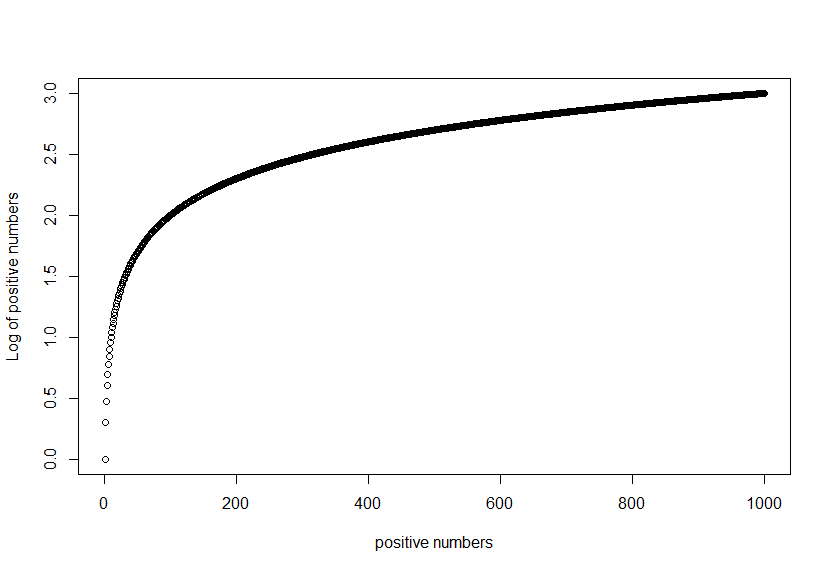
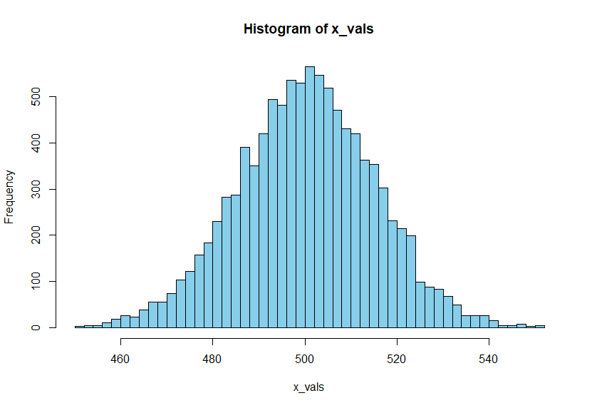

## Intro to R

#### Basic Motivation: 

Biology used to be a data poor discipline due to the cost to do experiments and technical difficulties, but now with Next Generation Sequencing, improvement in microscopy we have a lot of data now. 

In this data, there is 'True Biological Signal' but swimming in the sea of 'Technical Noise'. We need to ensure that our data is reproducible. This is coming from the Biological signal, not from Technical noise. 

That's why we need to know our data. In order to know our data, we need to visualize our data. 

#### Why visualization:


These 4 sets of data have same mean, variance and correlation. So we souldn't trust any data without visualization. Journals are asking for swarm plots or violin plots instead of box plots. Violin plots hide multi-modal distributions. 

#### Why R?
1. More comprehensive Statistical approach
2. Open Source, New Package
3. Reproducible Script. 

--- 
#### R basic:

- Basic Math on R prompt

```r
> 2 + 3
[1] 5

> log10(1000)
[1] 3
```

#### Vectorization
- R is a vectorized language. If you apply a function in a list of things, it applys it to each element in the list.

```r
> v = c(1,2,3,1,3,5,25)  #this a vector, c stands for combine. 
> v[2]  # will output the 2nd element, R is 1-indexed
  [1] 2 

> log2(v)
  [1] 0.000000 1.000000 1.584963 0.000000 1.584963 2.321928 4.643856

> x = 1:1000 # all numbers from 1 to 1000
> y = log(x)
> plot(x,y)
```

#### Analysis: mean(), median(), min(), max(), summary() 

```r
> mean(v)
  [1] 5.714286

> summary(v)
  Min. 1st Qu.  Median    Mean 3rd Qu.    Max. 
  1.000   1.500   3.000   5.714   4.000  25.000

> table(v)    #table provides unique elements and their frequencies.
v
 1  2  3  5 25 
 2  1  2  1  1  

```

#### Simple Scatter Plot: 

```r
> x_vals = 1:1000   #numbers ranging from 1 to 1000 
> y_vals = log10(x_vals)
> plot(x_vals,y_vals, xlab = "positive numbers", ylab = "Log of positive numbers")
```


#### Histogram:

```r
> x_vals = rnorm(10000, 500, 15)  #10000 normally distributed numbers with mean = 500, sd = 15
> hist(x_vals, breaks = 50, col="#87CEEB") 
```



---

This is a class note from **Aaron Quinlan's** [Advance Computational Genomics](https://github.com/quinlan-lab/applied-computational-genomics) course created by mmk. See acknowledgement in README.md