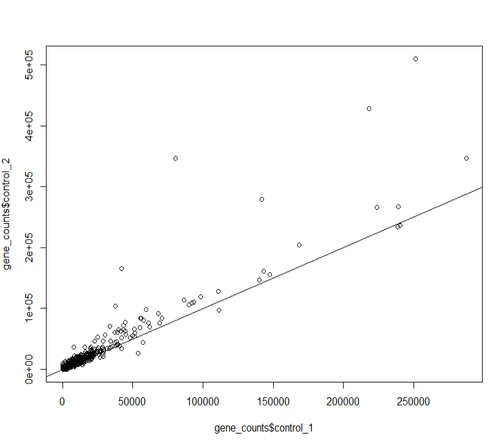
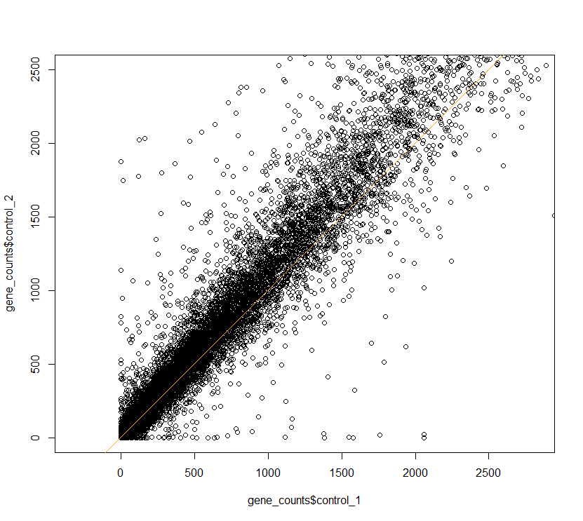
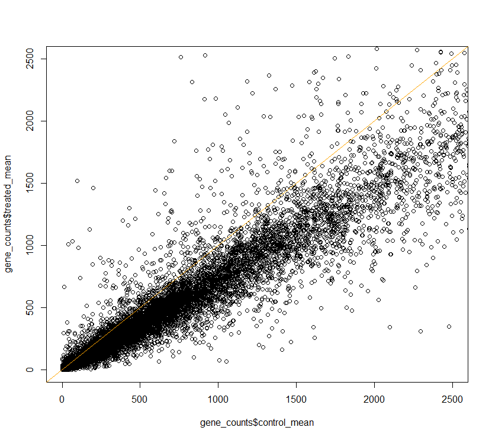
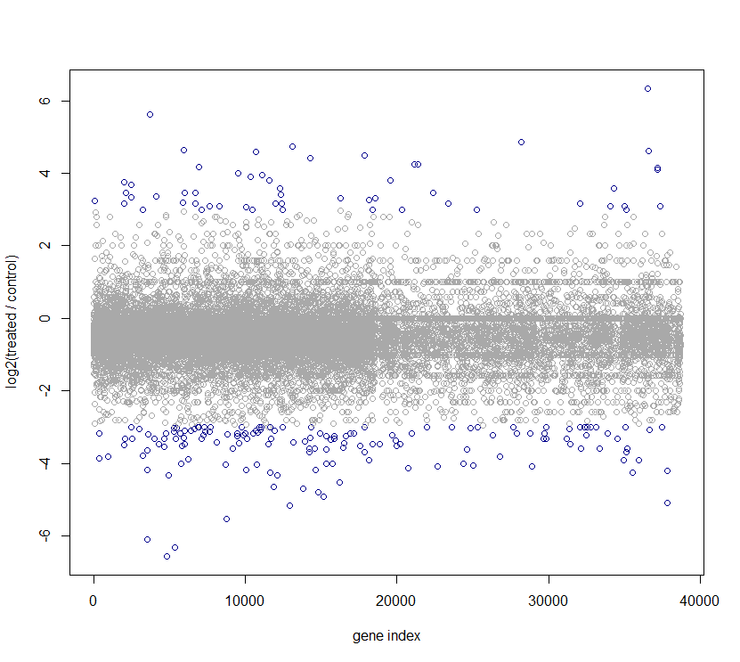

## Dataframe, Precision and Accuracy, Basic RNA-seq

#### Downloading data and Creating a dataframe

```r
> download.file(url="https://raw.githubusercontent.com/quinlan-lab/sllobs-biostats/master/data/lecture-03/airway_scaledcounts.subset.euro.fixed.tsv",destfile="genecounts.fixed.tsv")
# downloaded genecounts.fixed.tsv from url

> gene_counts <- read.table("genecounts.fixed.tsv", header = TRUE, dec = ",")
> View(gene_counts)
> dim(gene_counts)  #number of row,columns
[1] 38694     5
```

#### RNA-seq:
- We are sequencing cDNA. we collect rna from liver or any other organ, convert it into cDNA by using enzyme called *reverse transcriptase *. Because sequencing technology can't sequence RNA but cDNA. 

- Workflow:
    1. Collect mRNA or total RNA
    2. Remove contaminated DNA
    3. Fragment RNA
    4. Reverse transcribed to cDNA
    5. Ligate sequence adaptors (might do PCR Amplification)
    6. Select a range of sizes
    7. Sequence cDNA ends 
    8. We then align them to the genome, we count the number of reads aligned to each gene. 
    
Problems: 
- Systematic Biases in protocol
- Systematic Biases in processing (Sampling error)

#### Accuracy & Precision

**Accuracy**: how close a measured value is to the true value.

**Precision**: how closely measured values of the same entity are to each other. Represents reproducibility, how consistent the results are. 


#### Technical Replicate and Biological Replicate

Technical Replicate: Technical replicates are repeated measurements of the same sample that show independent measures of the noise associated with the equipment and the protocols.

Biological Replicate: Biological replicates are defined as measurements of biologically distinct samples that show biological variation.


Checking if technical replicates correlates: 
```r
> plot(x= gene_counts$control_1, y= gene_counts$control_2)
> abline(0,1)
```



Zooming on to the figure:

```r
> plot(x= gene_counts$control_1, y= gene_counts$control_2, asp=1, xlim=c(0,2500), ylim = c(0,2500))
> abline(0,1,col="orange")
```


Datapoints above y=x line were much expressed in Control condition 2 than in control group 1. That means expression of most genes were heigher in control condition 2. 


```r
> gene_counts$control_mean <- (gene_counts$control_1 + gene_counts$control_2) / 2 
> gene_counts$treated_mean <- (gene_counts$treated_1 + gene_counts$treated_2) / 2 
> 
> plot(gene_counts$control_mean, gene_counts$treated_mean, xlim=c(0,2500), ylim=c(0,2500))
> abline(0,1, col="orange") 
```



Datapoints above the orange line are over-expressed genes in Treated condition and below the line are under-expressed genes. 

#### Differential expression:

We use log2 fold to find out gene expression. 

```r
> gene_counts$logexpr = log2(gene_counts$treated_mean / gene_counts$control_mean)
```

Ploting the differentially expressed genes: 

```r
> gene_counts$color[gene_counts$logexpr >=3 | gene_counts$logexpr <=-3]="darkblue"
> gene_counts$color[gene_counts$logexpr <3  & gene_counts$logexpr >-3]="darkgray"  
> plot(gene_counts$logexpr, col=gene_counts$color, xlab="gene index", ylab="log2(treated / control)")
```



---

This is a class note from **Aaron Quinlan's** [Advance Computational Genomics](https://github.com/quinlan-lab/applied-computational-genomics) course created by mmk. See acknowledgement in README.md