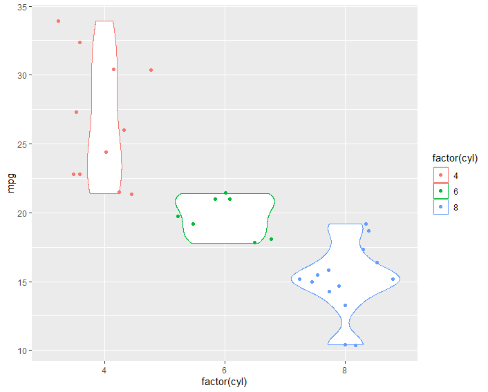

## SLOOBS-Intro to data visualization and ggplot2

#### histogram and scatterplot in regular R
```r
data(mtcars)
head(mtcars)

hist(mtcars$hp)
plot(mtcars$hp, mtcars$mpg)
```

#### installing package and importing
```r
install.packages("ggplot2")
library(ggplot2)
```

#### ggplot Basic
```r
ggplot(mtcars, aes(x=mpg, y=hp)) 
```
aes = Default list of aesthetic mappings to use for plot

```r
ggplot(mtcars, aes(x=mpg, y=hp))  + geom_point() 
```
geom_point adds an scatter plot
```r
ggplot(mtcars) + geom_point(aes(x=mpg, y=hp))
```
**Or…**
```r
ggplot() + geom_point(data=mtcars, aes(x=mpg, y=hp))

```
is also a valid way to do so.

```r
p <- ggplot(mtcars, aes(x=mpg, y=hp))
p + geom_point() + geom_smooth() +
  labs(x="Miles per gallon",y="Horsepower",title="Relationship between MPG and HP")
```
We can also store ggplot into an object. Here `p` is an object of ggplot.

geom_smooth() adds a regression line. ggplot2 default is locally-weighted regression. \
geom_smooth(method="lm") adds a linear regression line. (lm=linear model)

**More Aesthetics**
```r
p <- ggplot(mtcars, aes(x=mpg, y=hp))
p + geom_point(col="blue") + geom_smooth(method="lm", col="black", fill="red", alpha=0.25) +
labs(x="Miles per gallon",y="Horsepower",title="Relationship between MPG and HP")
```


#### More with ggplot

```r
p <- ggplot(mtcars, aes(x=mpg, y=hp, col=factor(cyl))) 
p + geom_point(size = 2) + labs(x="Miles per gallon",y="Horsepower",title="Relationship between MPG and HP")
```
The color of the points represents the number of cylender in car. factor() makes the data discrete. 


```r
p <- ggplot(mtcars, aes(x=mpg, y=hp)) + 
  geom_point(size = 2,aes(col=factor(cyl))) +
  geom_smooth(method="lm")

p
```
Adding a linear regression line and also coloring the points. 


#### Boxplot

```r
p <- ggplot(mtcars, aes(x=factor(cyl), y=mpg,col=cyl))
p + geom_boxplot(aes(col=factor(cyl))) 
```

**Adding Jitter:**
```r
cyl), y=mpg,col=cyl))
p + geom_boxplot(aes(col=factor(cyl))) + geom_jitter(aes(col=factor(cyl)))
```


**Violin Plot:**
```r
p <- ggplot(mtcars, aes(x=factor(cyl), y=mpg,col=cyl))
p + geom_violin(aes(col=factor(cyl))) + geom_jitter(aes(col=factor(cyl)))
```


#### Note:
**ggplot cheatsheet:** [https://www.rstudio.com/wp-content/uploads/2015/03/ggplot2-cheatsheet.pdf](https://www.rstudio.com/wp-content/uploads/2015/03/ggplot2-cheatsheet.pdf)


---

This is a class note from **Aaron Quinlan's** [Salt Lake Learners of Biostatistics](https://github.com/quinlan-lab/sllobs-biostats) course created by mmk. See acknowledgement in README.md

